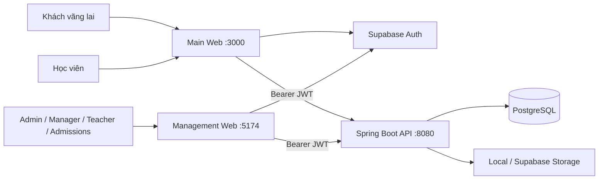

# The IELTS Spells Frontend

Frontend monorepo của **The IELTS Spells** — nền tảng quản lý, giảng dạy và học tập IELTS. Repository chứa hai ứng dụng triển khai độc lập nhưng dùng chung design system, kiểu dữ liệu và API client:

- **Main Web:** landing page, nội dung công khai và không gian học tập của học viên.
- **Management Web:** hệ thống vận hành dành cho Admin, Quản lý, Giáo viên và Nhân viên tuyển sinh.

> Supabase chỉ đảm nhiệm xác thực ở frontend. Dữ liệu nghiệp vụ phải đi qua Backend API, không truy vấn trực tiếp các bảng nghiệp vụ trong Supabase/PostgreSQL.

## Mục lục

- [Giới thiệu và mục tiêu](#giới-thiệu-và-mục-tiêu)
- [Vị trí trong hệ thống](#vị-trí-trong-hệ-thống)
- [Ứng dụng và đối tượng sử dụng](#ứng-dụng-và-đối-tượng-sử-dụng)
- [Công nghệ sử dụng](#công-nghệ-sử-dụng)
- [Cấu trúc dự án](#cấu-trúc-dự-án)
- [Luồng xác thực và dữ liệu](#luồng-xác-thực-và-dữ-liệu)
- [Cài đặt và chạy dự án](#cài-đặt-và-chạy-dự-án)
- [Biến môi trường](#biến-môi-trường)
- [Các lệnh thường dùng](#các-lệnh-thường-dùng)
- [Quy ước phát triển](#quy-ước-phát-triển)
- [Xử lý lỗi thường gặp](#xử-lý-lỗi-thường-gặp)

## Giới thiệu và mục tiêu

Repository cung cấp giao diện cho toàn bộ hệ sinh thái The IELTS Spells:

- Giới thiệu trung tâm, khóa học, lịch khai giảng và tiếp nhận đăng ký tư vấn.
- Cổng học viên để học, làm đề, nộp bài và theo dõi tiến độ.
- Vận hành khóa học, học viên, ghi danh, lịch học, session và điểm danh.
- Quản lý kho học liệu, media, ngân hàng đề và Reading Test Builder.
- Phân quyền giao diện theo vai trò và trạng thái tài khoản.

Mục tiêu kỹ thuật:

- Tách website công khai/cổng học viên và hệ thống quản trị để phát triển, triển khai độc lập.
- Dùng chung contract, API client, UI primitives và design tokens.
- Chỉ hiển thị dữ liệu thật từ API; nếu không có dữ liệu phải dùng empty state, không dùng dữ liệu giả dự phòng.
- Duy trì giao diện nhất quán, responsive và phù hợp nghiệp vụ trung tâm IELTS.

Theo nghiệp vụ hiện tại, **Course và Class được hợp nhất thành Course**. Mỗi khóa phụ trách một cặp kỹ năng: `LISTENING_READING` hoặc `SPEAKING_WRITING`.

## Vị trí trong hệ thống



Frontend chịu trách nhiệm hiển thị và nhập liệu. Backend là nguồn sự thật cho quy tắc nghiệp vụ, phân quyền, dữ liệu học vụ và tài nguyên.

## Ứng dụng và đối tượng sử dụng

| Thành phần | Đối tượng chính | Phạm vi |
| --- | --- | --- |
| `apps/main-web` | Khách vãng lai, học viên | Landing page, khóa học, tuyển sinh, student portal, luyện đề, bài tập và tiến độ |
| `apps/management-web` | Admin, Quản lý, Giáo viên, Tuyển sinh | Khóa học, học viên, ghi danh, lịch học, điểm danh, nhân sự, học liệu và ngân hàng đề |
| `packages/api-client` | Hai ứng dụng | HTTP client, Bearer token, chuẩn hóa lỗi và gọi Backend API |
| `packages/contracts` | Hai ứng dụng | Kiểu dữ liệu/contract dùng chung |
| `packages/design-tokens` | Hai ứng dụng | Màu sắc, typography, spacing và token thương hiệu |
| `packages/ui` | Hai ứng dụng | UI primitives và component dùng chung |

Web quản trị áp dụng mô hình **invitation-only**: Admin tạo hồ sơ và gửi lời mời; nhân sự kích hoạt tài khoản và hoàn thiện thông tin. Không có đăng ký công khai hoặc đăng nhập Google/Facebook cho nhân sự.

## Công nghệ sử dụng

| Nhóm | Công nghệ |
| --- | --- |
| Runtime | Node.js 24 |
| Package manager | pnpm 11.9 workspace |
| Ngôn ngữ | TypeScript 5.9 |
| UI core | React 19 |
| Main Web | Next.js 16 |
| Management Web | Vite 7, React Router 7 |
| Xác thực | Supabase JS 2 |
| Styling | Tailwind CSS 3.4, CSS variables, shared design tokens |
| Icon | Phosphor Icons |
| Kiểm tra tĩnh | TypeScript typecheck |

## Cấu trúc dự án

```text
the-ielts-spells-frontend/
├── apps/
│   ├── main-web/                 # Next.js: public site và student portal
│   │   └── src/app/              # App Router, pages, layouts và global styles
│   └── management-web/           # React + Vite: management portal
│       └── src/
│           ├── auth/             # Session, callback, route protection
│           ├── components/       # Component theo ứng dụng
│           ├── layout/           # Shell, sidebar và page layout
│           ├── lib/              # API, Supabase client, utilities
│           └── pages/            # Các trang nghiệp vụ
├── packages/
│   ├── api-client/               # API client dùng chung
│   ├── contracts/                # DTO/type dùng chung
│   ├── design-tokens/            # Token giao diện
│   └── ui/                       # Component dùng chung
├── DESIGN.md                     # Quy chuẩn giao diện
├── AGENTS.md                     # Workflow cho AI/cộng tác viên
├── pnpm-workspace.yaml
└── package.json
```

## Luồng xác thực và dữ liệu

1. Người dùng đăng nhập qua Supabase Auth.
2. Frontend nhận Supabase access token.
3. API client gửi `Authorization: Bearer <token>`.
4. Spring Boot xác minh JWT, vai trò và quyền.
5. Backend thực thi nghiệp vụ và trả dữ liệu.

Quy tắc an toàn:

- `main-web` có thể hỗ trợ phương thức đăng nhập phù hợp cho học viên.
- `management-web` chỉ dành cho nhân sự đã được mời và kích hoạt.
- Không đặt `service_role key`, database password hoặc backend secret trong frontend.
- Biến `NEXT_PUBLIC_*` và `VITE_*` xuất hiện trong bundle trình duyệt nên chỉ được chứa cấu hình công khai.

## Cài đặt và chạy dự án

### Yêu cầu môi trường

- Node.js 24.x
- pnpm 11.9.x
- Backend chạy tại `http://localhost:8080`
- Supabase project đã cấu hình Authentication

Nếu chưa có đúng phiên bản pnpm:

```bash
corepack enable
corepack prepare pnpm@11.9.0 --activate
```

### 1. Clone và cài dependencies

```bash
git clone <frontend-repository-url>
cd the-ielts-spells-frontend
pnpm install --frozen-lockfile
```

### 2. Tạo file cấu hình

Management Web đọc biến môi trường từ thư mục gốc workspace; Main Web đọc `.env.local` trong thư mục ứng dụng.

PowerShell:

```powershell
Copy-Item .env.example .env.local
Copy-Item .env.example apps/main-web/.env.local
```

Bash:

```bash
cp .env.example .env.local
cp .env.example apps/main-web/.env.local
```

Cập nhật URL Supabase và anon/publishable key trong hai file vừa tạo.

### 3. Chạy ứng dụng

Terminal 1:

```bash
pnpm dev:main
```

Main Web: [http://localhost:3000](http://localhost:3000)

Terminal 2:

```bash
pnpm dev:management
```

Management Web: [http://localhost:5174](http://localhost:5174)

## Biến môi trường

| Biến | Ứng dụng | Ý nghĩa |
| --- | --- | --- |
| `NEXT_PUBLIC_API_URL` | Main Web | Base URL Backend API |
| `NEXT_PUBLIC_SUPABASE_URL` | Main Web | URL Supabase project |
| `NEXT_PUBLIC_SUPABASE_ANON_KEY` | Main Web | Anon/publishable key |
| `VITE_API_URL` | Management Web | Base URL Backend API |
| `VITE_SUPABASE_URL` | Management Web | URL Supabase project |
| `VITE_SUPABASE_ANON_KEY` | Management Web | Anon/publishable key |

Ví dụ local:

```dotenv
NEXT_PUBLIC_API_URL=http://localhost:8080
VITE_API_URL=http://localhost:8080
NEXT_PUBLIC_SUPABASE_URL=https://<project-ref>.supabase.co
NEXT_PUBLIC_SUPABASE_ANON_KEY=<publishable-or-anon-key>
VITE_SUPABASE_URL=https://<project-ref>.supabase.co
VITE_SUPABASE_ANON_KEY=<publishable-or-anon-key>
```

Không commit `.env` hoặc `.env.local`.

## Các lệnh thường dùng

| Lệnh | Chức năng |
| --- | --- |
| `pnpm dev:main` | Chạy Main Web development |
| `pnpm dev:management` | Chạy Management Web development |
| `pnpm typecheck` | Kiểm tra TypeScript toàn workspace |
| `pnpm build` | Build tất cả package và ứng dụng |

Chạy riêng:

```bash
pnpm --filter @ielts/main-web build
pnpm --filter @ielts/management-web build
pnpm --filter @ielts/management-web typecheck
```

Trước Pull Request:

```bash
pnpm typecheck
pnpm build
```

Repository chưa chuẩn hóa test runner chung; thay đổi luồng nghiệp vụ cần được kiểm tra thủ công bên cạnh typecheck và build.

## Quy ước phát triển

- Đọc `AGENTS.md` trước khi sửa code và `DESIGN.md` trước khi đổi giao diện.
- Giữ ranh giới giữa hai app và các package dùng chung.
- UI dùng lại đặt trong `packages/ui`; contract dùng chung đặt trong `packages/contracts`.
- Ưu tiên design token, không hard-code màu/spacing khi token đã tồn tại.
- Không dùng dữ liệu giả để che lỗi API; thể hiện loading, empty và error state đúng.
- Ẩn nút theo quyền chỉ là UX; backend vẫn thực thi authorization cuối cùng.
- Không ghi JWT, secret hoặc thông tin nhạy cảm vào source/log.
- Thay đổi API phải đồng bộ contract và kiểm tra cả hai app liên quan.

## Xử lý lỗi thường gặp

### Chưa cấu hình Supabase

Kiểm tra đúng vị trí `.env.local`, đúng tên biến và khởi động lại dev server.

### API trả 401 hoặc 403

- `401`: token thiếu/hết hạn; đăng xuất và đăng nhập lại.
- `403`: tài khoản không có role/quyền phù hợp hoặc chưa kích hoạt.
- Xác nhận frontend và backend dùng cùng Supabase project.

### CORS bị chặn

Thêm `http://localhost:3000` và `http://localhost:5174` vào `CORS_ALLOWED_ORIGINS` của backend rồi khởi động lại backend.

### Không tải được dữ liệu

- Kiểm tra [http://localhost:8080/actuator/health](http://localhost:8080/actuator/health).
- Kiểm tra `NEXT_PUBLIC_API_URL` hoặc `VITE_API_URL`.
- Xem status code và response thật trong Network tab; không thay bằng mock data.

## Đóng góp

1. Tạo branch theo phạm vi thay đổi.
2. Chỉ sửa module/package liên quan.
3. Chạy typecheck và build.
4. Kiểm tra thủ công luồng người dùng bị ảnh hưởng.
5. Ghi rõ thay đổi API, UI, quyền truy cập và cách kiểm thử trong Pull Request.

Xem [AGENTS.md](./AGENTS.md) để nắm workflow phối hợp giữa các agent AI và thành viên dự án.
